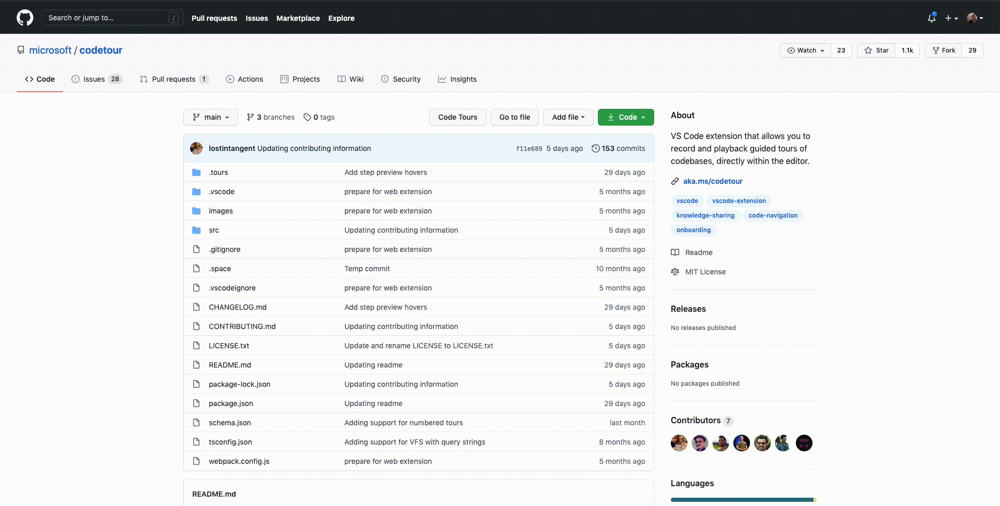

# Code Tours Github

## About

A browser extension that allows to play [code tours](https://marketplace.visualstudio.com/items?itemName=vsls-contrib.codetour) (guided walkthroughs of your codebase) directly from your Browser.
You can download the extension for Chrome and Firefox here:

## How it works

You can just browse to a repository in Github, click on "Code Tours", and select
the tour you want to play.

Here is what it looks like:

## Report issues

If you experience a missing feature or a bug, please create an issue in this
repository.
